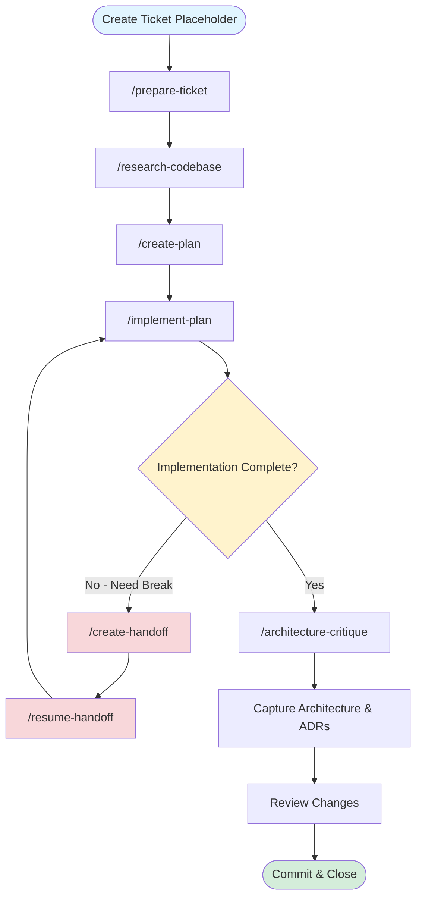

# IDLC Template

**I**ntent-**D**riven **L**ife**C**ycle - A structured workflow template for managing development with Claude Code.

📖 **[IDLC Wiki](https://github.com/HelixoidLLC/idlc-template/wiki)** — framework brief, philosophy, knowledge system, and setup guides.

## What is IDLC?

IDLC is a comprehensive workflow system that integrates tickets, research, plans, and handoffs into a unified knowledge management structure. This template provides the foundation for organizing complex development work across multiple sessions while maintaining context and continuity.

## IDLC Workflow



### Workflow Steps

1. **Create Ticket Placeholder** - Initialize ticket in `knowledge/tickets/`
2. **`/prepare-ticket`** - Gather requirements and context
3. **`/research-codebase`** - Investigate codebase and document findings
4. **`/create-plan`** - Create detailed implementation plan
5. **`/implement-plan`** - Execute plan with verification checkpoints
6. **Loop Until Done** - Continue implementation across sessions:
   - **`/create-handoff`** - Document state before ending session
   - **`/resume-handoff`** - Resume work from previous session
7. **`/architecture-critique`** - Review architectural decisions and patterns
8. **Capture Architecture & ADRs** - Document architectural decisions
9. **Review and Commit** - Final review and commit changes

## Getting Started

### 1. Update AGENTS.md for Your Project

Shared, harness-neutral instructions live in **`AGENTS.md`** at the repo root.
`CLAUDE.md` is a thin wrapper that imports it (`@AGENTS.md`) and adds only
Claude Code-specific notes. Edit `AGENTS.md` for anything that should apply to
every agent; edit `CLAUDE.md` only for Claude-specific behavior. This is what
makes the config portable — see [`PORTABILITY.md`](PORTABILITY.md).

Edit `AGENTS.md` to reflect your project's structure and conventions:

- **Keep it minimal**: Only include essential project information in AGENTS.md
- **Use file references**: For detailed documentation, create separate files in `docs/` or `knowledge/` and reference them
- **Update project metadata**: Replace placeholder values (e.g., `{PROJECT_NAME}`, `{package-manager}`, `{build-tool}`)
- **Document your stack**: Specify languages, frameworks, databases, and tools
- **Define conventions**: Code style, file organization, testing approach

**Example structure:**

```markdown
# Project Overview

Brief description of what the project does

# Repository Structure

Key directories and their purposes

# Build Commands

Commands for development, testing, building

# Architecture

Core components and tech stack

# Development Workflow

How to work with your specific tools/processes
```

### 2. Customize .claude/ Configuration

Adapt the `.claude/` directory to your workflow:

#### Commands / Skills (`/.claude/skills/`)

Workflow commands are implemented as **user-invocable skills**: a skill at
`.claude/skills/create-plan/SKILL.md` is invoked as `/create-plan`. This is the
portable format — other harnesses read the same `SKILL.md` directories (see
[`PORTABILITY.md`](PORTABILITY.md)).

- **Update ticket prefixes**: Change `PROJ-XXXX` to your ticket system prefix (e.g., `JIRA-123`, `GH-456`)
- **Adjust knowledge structure**: Modify paths if using different organization (e.g., `knowledge/tickets/`, `knowledge/research/`)
- **Tune workflows**: Customize research, planning, and implementation processes for your team

#### Agents (`/.claude/agents/`)

- Review and customize specialized agents
- Add project-specific agents if needed
- Remove agents you won't use

#### Skills (`/.claude/skills/`)

- Keep relevant skills for your workflow
- Add custom skills for project-specific tasks
- Configure skill permissions and models

#### Settings (`/.claude/settings.local.json`)

- Set default models and permissions
- Configure project-specific preferences

### 3. Use CLI Tooling Over MCP

**Philosophy**: Prefer standard CLI tools and commands over MCP servers when possible.

**Why?**

- More maintainable and portable
- Better version control and reproducibility
- Clearer for team members to understand
- Faster execution in most cases

**When to use MCP**:

- Browser automation (Claude in Chrome)
- IDE integrations (if needed)
- Custom integrations not available via CLI

**When to use CLI**:

- Git operations: `git`, `gh` CLI
- Build tools: `npm`, `cargo`, `go`, etc.
- Database tools: `psql`, `sqlite3`, etc.
- Testing: `pytest`, `jest`, etc.
- File operations: standard bash tools

### 4. Knowledge Directory Structure

The full folder map, naming conventions, and per-folder purpose live in
**[`knowledge/README.md`](knowledge/README.md)** — start there.

> [!IMPORTANT]
> **Everything shipped under `knowledge/` is placeholder content.** Every ticket,
> research doc, ADR, plan, review, ontology entry, and PRD in this template is
> invented sample data for a fictional product. None of it describes your project.
>
> It's there for one reason: to show you what each artifact type actually _looks
> like_ when done well — real structure, real cross-links, real frontmatter — so
> you're not staring at an empty folder wondering what goes in it. AI agents are
> pattern-matchers at their core: point one at these worked examples and it will
> reliably reproduce the same shape for your own work. Use them to bootstrap.
>
> **On adoption: delete the samples, keep the structure.** Then let real artifacts
> accumulate as you work — don't backfill your whole history.

The samples are wired together as one coherent example thread (a ticket flows into
research → ADR → plan → handoff → review → validation), so you can trace how the
pieces reference each other end to end.

### 5. Core Workflows

#### Research Workflow

```bash
/research-codebase
```

- Spawns parallel agents to investigate codebase
- Creates structured research documents
- Stores findings in `knowledge/research/`

#### Planning Workflow

```bash
/create-plan knowledge/tickets/PROJ-123.md
```

- Reads ticket and conducts research
- Creates detailed implementation plan
- Saves to `knowledge/plans/`

#### Implementation Workflow

```bash
/implement-plan knowledge/plans/2025-01-15-PROJ-123-feature.md
```

- Executes plan with verification
- Tracks progress with automated and manual checkpoints
- Creates commits when requested

#### Handoff Workflow

```bash
/create-handoff
```

- Documents current session state
- Captures learnings and next steps
- Stores in `knowledge/handoffs/PROJ-XXXX/`

Resume work:

```bash
/resume-handoff PROJ-123
```

## Best Practices

### Documentation

- Keep CLAUDE.md under 500 lines
- Split detailed docs into separate files
- Use clear, descriptive file names
- Include examples and code snippets

### Knowledge Management

- One ticket = one directory in `knowledge/tickets/`
- Research documents should be dated and tagged
- Plans should have clear success criteria (automated + manual)
- Handoffs should include all context for resumption

### Tool Usage

- Use dedicated tools (Read, Edit, Grep, Glob) over bash
- Batch independent operations in parallel
- Verify changes before committing
- Run tests after significant changes

### Git Workflow

- Never auto-commit without explicit request
- Use descriptive commit messages
- Reference tickets in commits
- Keep commits focused and atomic

## Customization Examples

### Different Ticket System

Replace `PROJ-XXXX` with your format:

```bash
# In .claude/skills/**/SKILL.md files
sed -i 's/PROJ-/JIRA-/g' .claude/skills/**/SKILL.md
```

### Alternative Knowledge Structure

If you prefer different organization:

```
knowledge/
├── issues/       # Instead of tickets/
├── analysis/     # Instead of research/
├── designs/      # Instead of plans/
└── transfers/    # Instead of handoffs/
```

Update path references in `.claude/skills/**/SKILL.md` accordingly.

### Team-Specific Conventions

Add to CLAUDE.md:

- Branching strategy
- Code review requirements
- Testing standards
- Deployment procedures

## Going Deeper

### The Infrastructure Layer

`docs/agentic_infrastructure.md` — The operational setup that makes IDLC work at scale. Read this when you are ready to move beyond single-agent, single-session work and want to run multiple agents concurrently, guarantee clean sessions, and control what agents are allowed to do autonomously. Covers:

- **Parallel execution** — How to use `scripts/create_worktree.sh` to create isolated git worktrees per feature, run multiple Claude Code instances simultaneously without conflicts, and merge results back cleanly.
- **Session isolation** — How the `.devcontainer` template ensures every agent session starts from a known, reproducible state with pinned tool versions and shared Claude authentication.
- **Permission architecture** — How to configure `.claude/settings.local.json` with allow/deny rules, environment variables, and PreToolUse hooks to define exactly what agents can do before they do it.
- **Autonomous mode** — The three prerequisites that must be true before using `claude --dangerously-skip-permissions`, and how to disable it organization-wide when those conditions are not met.

## Tools Reference

### Essential Files

- `AGENTS.md` - Shared, harness-neutral project instructions (canonical)
- `CLAUDE.md` - Claude Code entry point (imports `AGENTS.md` + Claude-only notes)
- `PORTABILITY.md` - How the config maps to Codex, Cursor, Copilot, and Pi
- `TOOLS.md` - Tool usage documentation
- `.claude/skills/` - Workflow commands + skills
- `.claude/agents/` - Specialized subagents
- `knowledge/` - Persistent knowledge base ([`knowledge/README.md`](knowledge/README.md) — index; all contents are placeholder examples)

### Key Commands

- `/prepare-ticket` - Gather requirements
- `/research-codebase` - Investigate codebase
- `/create-plan` - Create implementation plan
- `/implement-plan` - Execute plan with verification
- `/create-handoff` - Document session state
- `/resume-handoff` - Continue from handoff

## Contributing

This template is designed to be forked and customized. Share improvements:

- Better workflow patterns
- Useful agent configurations
- Documentation improvements
- Tool integrations

## License

MIT License - customize and use as needed for your projects.
